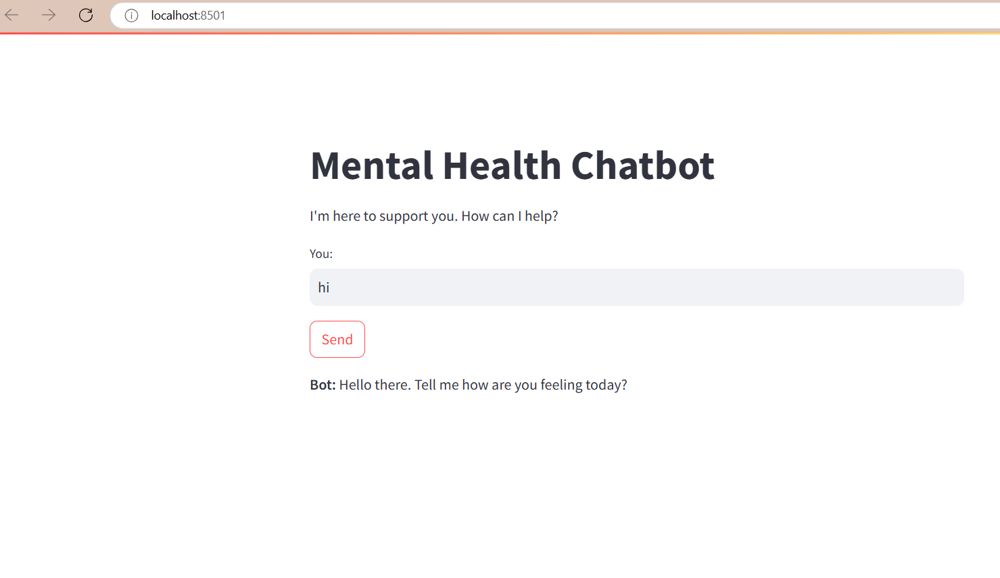
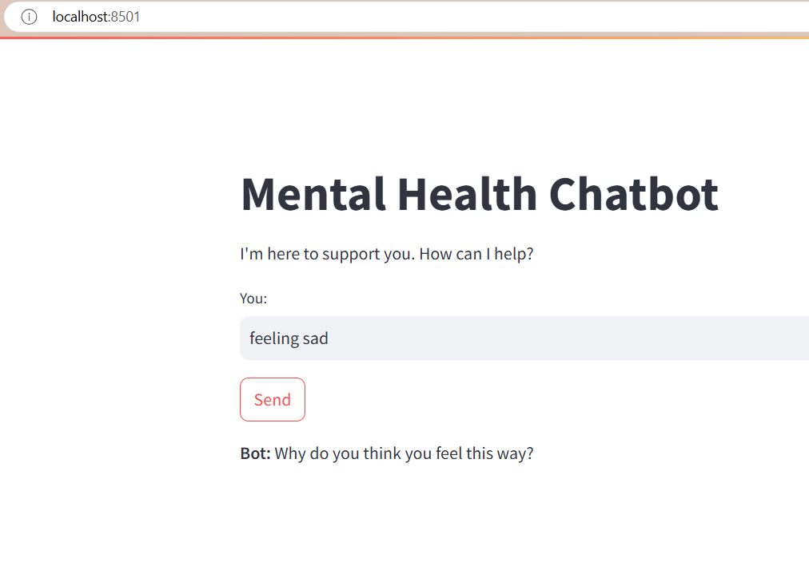
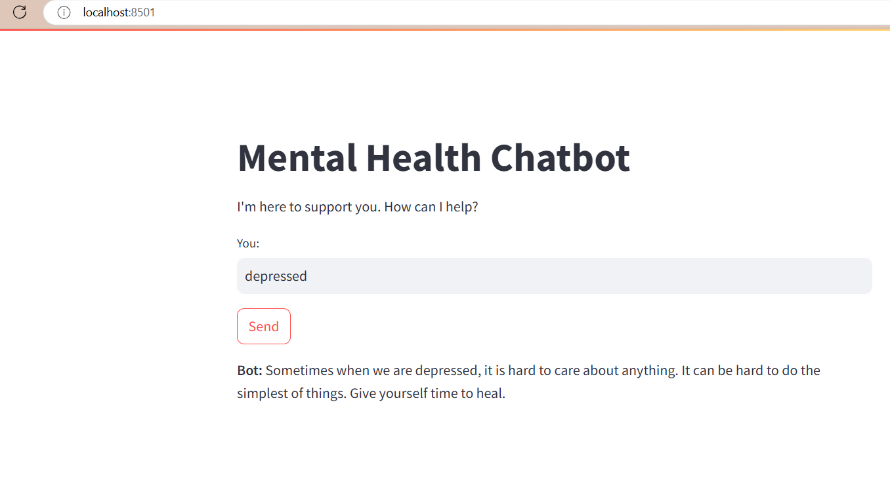

# Chatbot Project

## Description
This project was developed for a hackathon and implements a simple chatbot using Natural Language Processing (NLP) and a neural network. It utilizes TensorFlow and Keras to train a model based on user intents defined in a JSON file. The chatbot is designed to understand user input and respond appropriately based on predefined intents.

## Features
- NLP preprocessing of user inputs
- Customizable intents and responses
- Neural network model for intent classification
- Real-time interaction capabilities

## Hackathon Presentation
This project was presented at **[Hackathon Name]**, where we aimed to create an engaging and functional chatbot. The feedback received helped enhance its functionality and user experience.

## Screenshots

*Response for hi*


*response for feeling sad*


*response for depressed*

## Requirements
- Python 3.x
- TensorFlow
- Keras
- NLTK
- NumPy

## Setup Instructions

1. **Clone the repository**:
   ```bash
   git clone https://github.com/bk790/Mental_Health_Chatbot.git
   


2. **Install the required packages**:
   ```bash
   pip install -r requirements.txt
   ```

3. **Download NLTK data**:
   Ensure you have the required NLTK datasets by running the following in a Python shell:
   ```python
   import nltk
   nltk.download('punkt')
   nltk.download('wordnet')
   ```

4. **Prepare your `intents.json` file**:
   Create a JSON file named `intents.json` with your predefined intents and responses. Ensure the structure matches the expected format.

5. **Train the model**:
   Run the main script to train the model:
   ```bash
   python main.py
   ```

6. **Run the chatbot**:
   After training, use the model to make predictions. Replace the input message in the script with your own and run it to see the output.

## Usage
To interact with the chatbot, modify the input message in the script and execute it. The chatbot will predict the intent and return an appropriate response based on the trained model.

## License
This project is licensed under the MIT License - see the [LICENSE](LICENSE) file for details.

## Acknowledgments
- TechFest_Digital University Kerala - For the opportunity to showcase this project
- [TensorFlow](https://www.tensorflow.org/)
- [Keras](https://keras.io/)
- [NLTK](https://www.nltk.org/)
```


